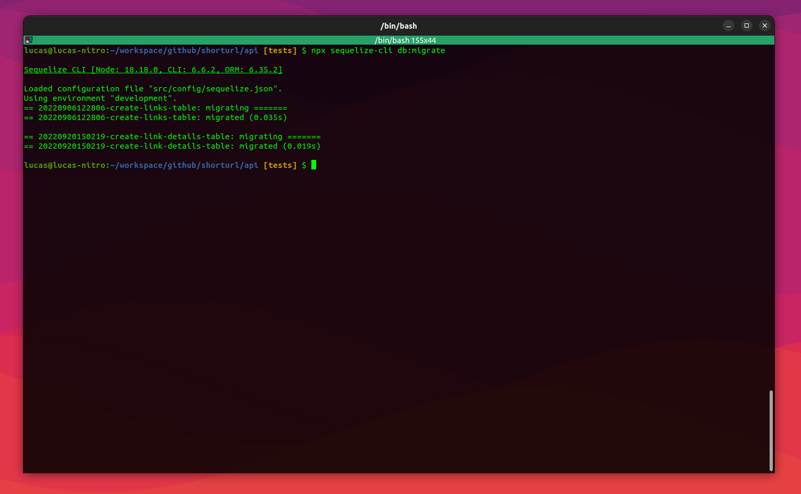
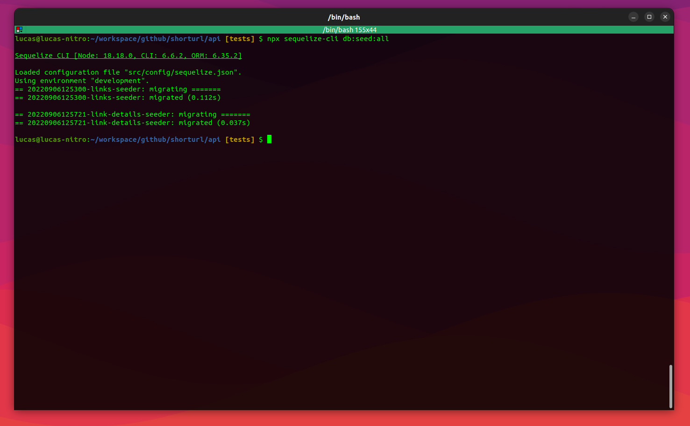
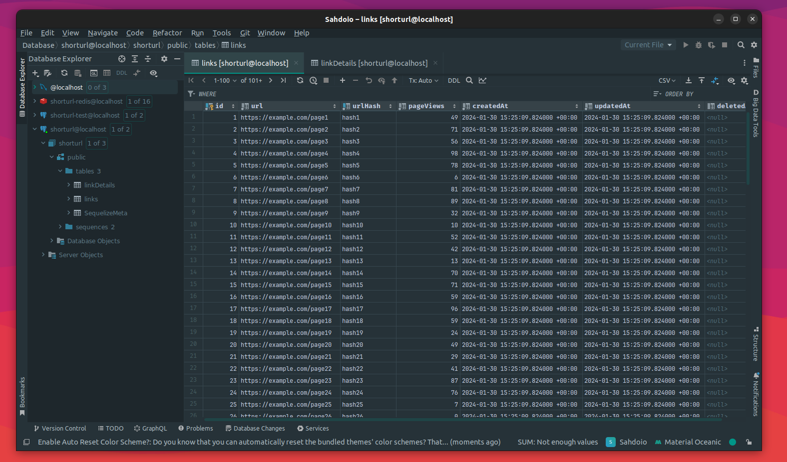
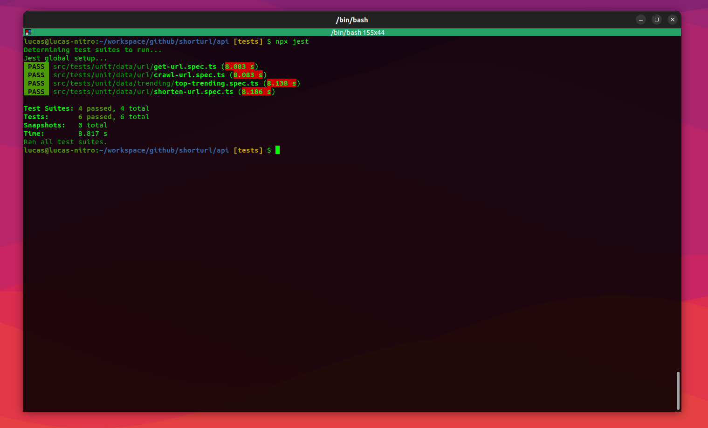
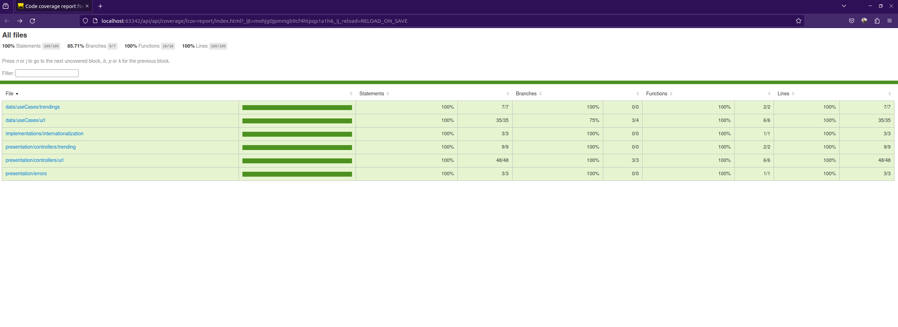
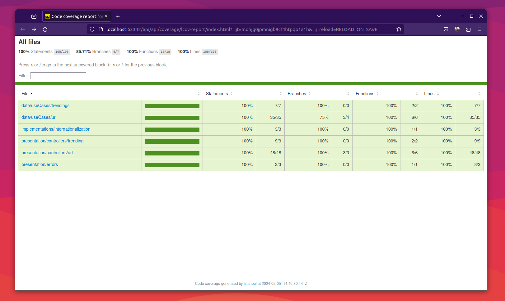

# ShorURL API #

This is an API Rest developed with NodeJs, TypeScript and Clean Architecture.

* node version: 18.18.0
* Database: PostgreSQL
* TypeScript
* Tests made with Jest
* Containers with Docker

### How do I get set up? ###

* .env
  
  Rename or copy the .env.example to .env

        cp .env.example .env

  The .env is configured to use docker database setup

* build app

    In the app root (the same dir where is located the package.json and this README) run:

        docker compose up --build -d
    
    The above command will add the databases containers and the redis container as well

    Install node_modules

        npm install

### Database Setup ###

Before start to test the application you should run the migrations and seeder to setup the development database and the test database as well to run the integration tests

* Running migration for development 
        
        npx sequelize-cli db:migrate

    

* Running migration for test

        npx sequelize-cli db:migrate --env test

* Running seeders for development 
        
        npx sequelize-cli db:seed:all

    

* Running seeders for test

        npx sequelize-cli db:seed:all --env test

* The final result:
  
    

### Running project ###

* Execute

        npm run dev

### How to run unit tests? ###

* Normal test  
        
      docker-compose exec shorturl npx jest

    

* With coverage

        docker-compose exec shorturl npx jest --coverage
    
    Terminal version

    

    Html version

    

* Postman Project

    See [Postman Collection](./docs/collection.json)
  
### Who do I talk to? ###

* Lucas Sahdo - lucassahdo@gmail.com
