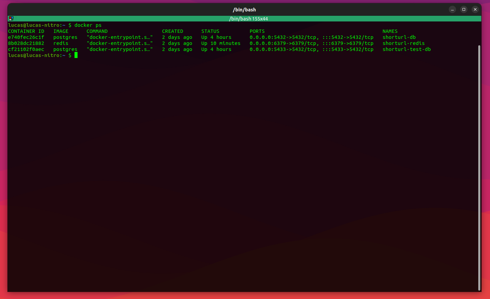

# ShortURL Project

Welcome to ShortURL, a monorepo containing two main components: the API and the App. The API is a robust Node.js backend, and the App is a dynamic Next.js frontend.

## Project Structure

- `/api`: The Node.js backend developed with TypeScript, implementing Clean Architecture.
- `/app`: The Next.js frontend application.

---

## API - Backend

### Overview

This is a REST API developed with NodeJs, TypeScript, and Clean Architecture principles.

- Node version: 18.18.0
- Database: PostgreSQL
- TypeScript
- Tests: Jest
- Containers: Docker

### Backend Setup

Every command on the backend setup must be executed inside **api** folder.

#### Environment Setup

- Rename or copy the `.env.example` to `.env`:

      cp .env.example .env

  The `.env` is configured to use docker database setup.

#### Build App

- In the app root (the same dir where the package.json and this README are located), run:

      docker compose up --build -d

  This command will set up the databases and Redis containers.

  

- Install node_modules:

      npm install

#### Database Setup

Before starting the application, run migrations and seeders for both development and test databases.

- Running migration for development:

      npx sequelize-cli db:migrate

  

- Running migration for test:

      npx sequelize-cli db:migrate --env test

- Running seeders for development:

      npx sequelize-cli db:seed:all

  

- Running seeders for test:

      npx sequelize-cli db:seed:all --env test

- Final Database Setup:

  

#### Running the Project

- To execute:

      npm run dev

#### Running Unit Tests

- For normal tests:

      npx jest

  

- Postman Project:

  [Postman Collection](./docs/collection.json)

---

## App - Frontend

### Overview

The ShortURL App is a responsive and user-friendly frontend developed with Next.js. It provides a seamless interface for interacting with the ShortURL API, allowing users to create and manage shortened URLs efficiently.

### Frontend Setup

Every command on the backend setup must be executed inside **app** folder.

#### Installing Dependencies

To set up the frontend, start by installing the necessary dependencies:

    npm install

#### Config file

Rename or copy the `.env.example` to `.env`:
 
    cp .env.example .env.local

#### Running the Project

To execute:

    npm run dev

---

# Contact

- Lucas Sahdo - lucassahdo@gmail.com

